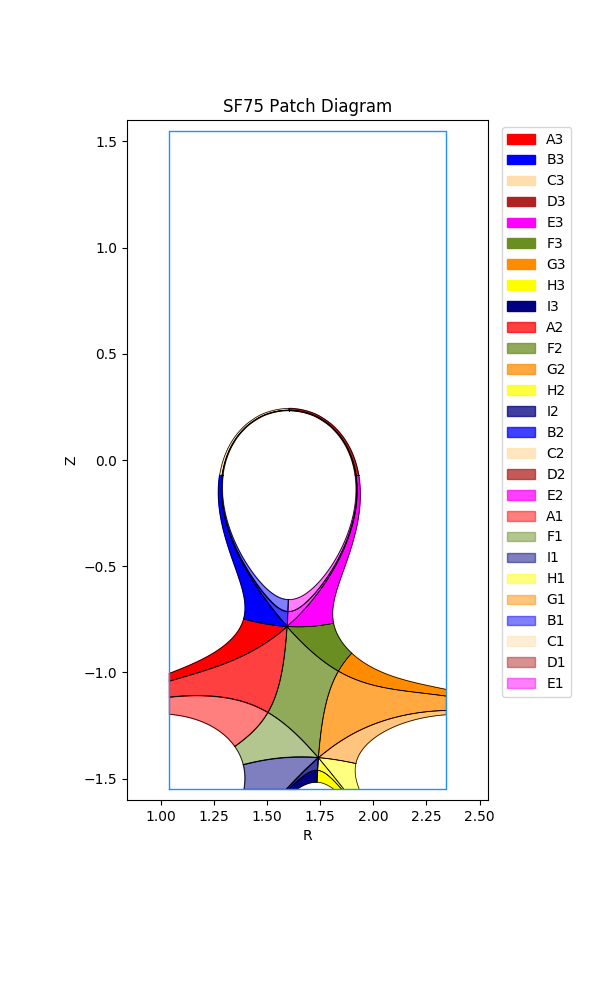

****************************************************
Example: Two x-points in domain (SF75 example)
****************************************************

.. note:: This tutorial assumes the reader has already read both the `introductory SNL tutorial <snl_example_1>`_ and the `further exploration SNL tutorial <snl_example_2>`_.

Here we will demonstrate how to generate a grid when there are two x-points in the domain. In particular, we will generate a grid for a snowflake-75 (SF75) configuration. 

Because INGRID internally handles the identification and classification of magnetic topology, the general steps detailed here for generating a grid apply to **all** the other configurations with two x-points in the domain. 
The user will only need to refer to provided diagrams of a configuration's Patch map, x-point NSEW directions, and psi labels for a specific configuration.

Loading our example
===================
The parameter file ``SF75.yml`` we will use in this tutorial is located in ``example_files/SF75``. 

A key difference inside the parameter file is that now the entry ``num_xpt`` has an associated value of ``2``. This **activates** INGRID's topology classification when two x-points are present in the domain. With this,
INGRID now expects more parameter file entries from the user. These include:

* Approximate R coordinate of secondary x-point ``rxpt2``
* Approximate Z coordinate of secondary x-point ``zxpt2``
* Additional psi entries ``psi_2`` and ``psi_pf_2``
* Limiter data (or usage of EFIT domain bounds to act as a psuedo-limiter)
* Two additional target plates (when ``strike_pt_loc`` has an associated value of ``target plates``)

Loading the parameter file in the GUI and viewing the data should show the following.

We can immediately see the presence of a secondary x-point, it's corresponding separatrix, a rectangular (psuedo) limiter and additionaly psi lines that we will use to generate a Patch map.

Before generating a Patch map, we discuss the SF75 layout.

The SF75 line-tracing pattern, x-point directions, and psi labels
=================================================================

The figure below shows a Patch map for general SF75 configuration.

The user should reference the above figure when prepping the parameter file for generating a Patch map by verifying target plates are in valid locations relative to x-points and psi-boundaries.

First, note the target plate naming convention ``plate_W1``, ``plate_E1``, ``plate_W2``, and ``plate_E2``. Again, by removing notions of "inner" and "outer" plates in the ``SNL`` case, we see that we now have a general naming convention that can be applied to all configurations with two x-points in the domain. 

This naming convention is defined by the NSEW directions for both the primary x-point (``xpt1``) and secondary x-point (``xpt2``). Below we can see two figures that illustrate the NSEW directions for ``xpt1`` and ``xpt2``, respectively. 

Finally, we illustrate the psi-labels associated with the psi-boundaries of the SF75 configuration.

The above shows we now have parameter file entries ``psi_2`` and ``psi_pf_2`` to assign values to. 

We will see in other configurations (e.g. ``UDN``, ``SF45``, etc) that the location of the psi labels **will** vary. Because the location of psi boundaries vary with each configuration, the user must carefully note which psi boundaries they are dealing with.

In general, ``psi_1`` will correspond to psi-max, ``psi_core`` remains set to the core psi value, ``psi_pf_1`` will correspond to the psi-surface we intersect by tracing ``S`` of ``xpt1``, and ``psi_pf_2`` will correspond to the psi-surface we intersect by tracing ``S`` of ``xpt2``. Typically, the ``psi_2`` psi-boundary and strike-point locations for the psi-entries listed above often vary.

Activating the limiter for Patch generation
============================================

Understanding INGRID limiter usage is an essential part of generating a Patch map for cases with two x-points in the domain.

INGRID does not require the use of target plates for generating a Patch map if the user opts for using a limiter. 

This is controlled within the parameter file with ``strike_pt_loc`` within the ``patch_generation`` block. We see this below.

.. code-block:: YAML

  grid_settings:

    # ...
    # other settings
    # ...

    patch_generation:
      # ...
      # other settings
      # ...

      # strike_pt_loc takes the values of 'limiter' or 'target_plates'
      strike_pt_loc: limiter  # generates a Patch map with a limiter rather than target plates

When ``strike_pt_loc`` is set to a value of ``limiter``, INGRID will utilize all geometry data provided in the parameter file block labeled ``limiter``. 

We can see the ``limiter`` settings in ``SF75.yml`` below.

.. code-block:: YAML

  grid_settings:

    # ...
    # other settings
    # ...

    patch_generation:
      # ...
      # other settings
      # ...

      # strike_pt_loc takes the values of 'limiter' or 'target_plates'
      strike_pt_loc: limiter  # generates a Patch map with a limiter rather than target plates

  # Specifications for using a limiter
  limiter:

    file: ''  # File name of .txt file with coordinates specifying limiter geometry.

    use_efit_bounds: true  # Use the EFIT domain boundary as a limiter

    # Coordinates: [(rmin, zmin), (rmax, zmin), (rmax, zmax), (rmin, zmax), (rmin, zmin)]

    zshift: 0.0  # Shift the limiter geometry in the z-direction
    rshift: 0.0  # Shift the limiter geometry in the z-direction

    # Adjust shape of EFIT domain boundary psuedo-limiter in r coordinate
    efit_buffer_r: 0.2  # Default value: 1.0e-2

    # Coordinates: [(rmin + efit_buffer_r, zmin), (rmax - efit_buffer_r, zmin), 
    #               (rmax - efit_buffer_r, zmax), (rmin + efit_buffer_r, zmax), (rmin + efit_buffer_r, zmin)]

    # Adjust shape of EFIT domain boundary psuedo-limiter in z coordinate 
    efit_buffer_z: 0.05  # Default value: 1.0e-2

    # Coordinates: [(rmin, zmin + efit_buffer_z), (rmax, zmin + efit_buffer_z), 
    #               (rmax, zmax - efit_buffer_z), (rmin, zmax - efit_buffer_z), (rmin, zmin + efit_buffer_z)]

.. note:: INGRID will utilize the default limiter data provided within the ``eqdsk`` file if no file is provided and ``use_efit_bounds`` is set to ``False``. If no limiter data is available in the ``eqdsk`` file, INGRID will set ``use_efit_bounds`` to 
  ``True``.

Below are figures illustrating possible edits to the parameter-file ``limiter`` block entry (we will **not** be using these values for the remainder of the tutorial). 

First, setting ``use_efit_bounds`` to ``False`` (default ``eqdsk`` limiter data)

Next, setting ``use_efit_bounds`` back to ``True``, but setting both ``efit_buffer_r`` and ``efit_buffer_z`` back to their **default** values of ``1.0e-2``.

.. warning:: When setting ``use_efit_bounds`` to ``True``, the user must provide a non-zero value for values ``efit_buffer_r`` and ``efit_buffer_z``.

INGRID identification of configuration
======================================

As mentioned in the previous section, understanding INGRID limiter usage is an essential part of generating a Patch map for cases with two x-points in the domain.

This is because INGRID identifies a configuration by decomposing subset of the domain contained within the limiter into three distinct regions: core, private-flux, and separatrix exterior. 

We see this below with the core shaded in magenta, private-flux shaded in blue, and separatrix exterior with no filled shading.

To emphasize the dependence on the limiter for decomposition, we also illustrate with setting both ``efit_buffer_r`` and ``efit_buffer_z`` back to their **default** values of ``1.0e-2``.

**It is up to the user to ensure the following is satisfied for successful identification of magnetic topology:**

* The provided limiter forms a closed loop (note EFIT bounds do this by default and is therefore a useful tool for classification)
* The Magnetic-axis is contained within the closed limiter geometry
* The primary x-point is contained within the closed limiter geometry
* The primary separatrix "legs" intersect the limiter walls and form a closed region
* The secondary x-point is contained within the closed limiter geometry

We can indeed see that our parameter file has been preset to satisfy all of the above.

Using target-plates for generating a Patch map
==============================================

The user can opt for using target-plates rather than a limiter for generating a Patch map for cases with two x-points in the domain. Setting the entry ``strike_pt_loc`` to ``target_plates`` tells INGRID to generate the Patch map
using geometry provided in the parameter file block ``target_plates``. We see this snippet below.

.. code-block:: YAML

  grid_settings:

    # ...
    # other settings
    # ...

    patch_generation:
      # ...
      # other settings
      # ...

      # strike_pt_loc takes the values of 'limiter' or 'target_plates'
      strike_pt_loc: target_plates  # generates a Patch map with a target_plates rather than limiter block

  # Specifications for using target plates
  target_plates:

    # Target plate E of xpt1
    plate_E1: 
      file: ../data/SF75/plate_E1.txt
      rshift: 1.0
      zshift: 0.28

    # Target plate E of xpt2
    plate_E2:
      file: ../data/SF75/plate_E2.txt
      rshift: 0.45
      zshift: 0.00

    # Target plate W of xpt1
    plate_W1:
      file: ../data/SF75/plate_W1.txt
      rshift: -0.2
      zshift: 0.2

    # Target plate W of xpt2
    plate_W2:
      file: ../data/SF75/plate_W2.txt
      zshift: 0.0
      rshift: 0.00

The user can refer to the diagrams earlier in the tutorial to see where the target plates above should reside in the domain. 

By making the above edits, we then refresh our view of the data to obtain the following plot.

Indeed, we see there are now four target plates in the EFIT domain.

.. note:: **The presence of the limiter in the figure is not a bug.** Regardless of whether we decide to utilize the limiter or target plates for generating a Patch map, INGRID still relies on the limiter to classify the magnetic topology.
  This is why the user must be comfortable with limiter controls.

Creating the Patch map and grid
================================

The majority of the effort for generating a Patch map goes into the preparation of the EFIT data. We indeed saw this in the previous sections. From here, we carry out the usual process of generating a Patch map that we saw in the SNL case.

All of the Patch map edit capabilities that we performed on the ``SNL`` cases are also available for all other cases with no further explanation. 

We proceed with Patch map generation and obtain the following Patch map when keeping ``strike_pt_loc`` set with a value of ``target_plates``.

If we had kept ``strike_pt_loc`` set to ``limiter``, we would obtain the Patch map below.

All grid generating instructions detailed in the ``SNL`` case also apply to the ``SF`` cases. The only difference is the addition of an additional control ``nr_3`` that controls the Patch objects with name ending with ``3``.

Using ``np_default`` and ``nr_default`` with values of ``3`` produces the following grid when using target plates.

Using ``np_default`` and ``nr_default`` with values of ``3`` produces the following grid when using the limiter.

All other grid generation customization tools such as ``skewness_correction``, ``poloidal_f_A`` - ``poloidal_f_I``, and ``radial_f_1`` - ``radial_f_3`` are utilized in the same ways we saw in the earlier ``SNL`` cases. 

