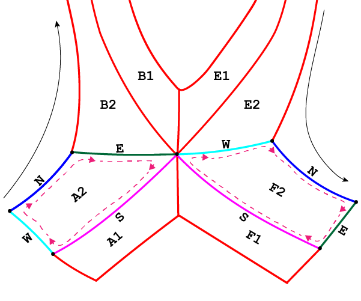

********************************************************
Example: single-null configuration (further exploration)
********************************************************

.. note:: This tutorial assumes the reader has already explored the `introductory SNL tutorial <snl_example_1>`_.

Some cases **require** enabling of certain attributes in the parameter file in order to successfully produce a grid. 

Here we will detail said cases, and also dig deeper into INGRID's capabilities for generating a grid. This tutorial will:

* Detail when adjustment to line-tracing algorithm is required by user
* Illustrate how to make adjustments to a generated ``Patch`` map 
* Illustrate how to apply poloidal/radial transformations for non-uniform grid spacing
* Demonstrate how to reduce cell-shearing (increase orthoganality) of a grid via ``skewness_correction``

Loading our example
===================
The parameter file ``cmod_param.yml`` we will use in this tutorial is located in ``example_files/SNL``. 

Loading the parameter file in the GUI and viewing the data should show the following.

Immediately we see that there is a line segment originating from the primary x-point and extending to the EFIT domain boundary.

This is an indicator that INGRID will be overriding the default line tracing behavior from the primary x-point. As for why and how we
activate this capability will be detailed in the next section. 

Standard SNL primary x-point line tracing pattern
=================================================
INGRID utilizes specific line tracing procedures for each supported topology. Below is a cartoon of line tracing directions from the primary x-point.

Tracing in direction **N, S, E, W** are orthogonal to flux surfaces.

Note that line tracing from the **W** and **E** directions terminate upon intersection with the psi-max surface. Upon intersection with the psi-max surface, line tracing continues
along the poloidal line and searches for intersection with a target plate. 

*In this particular example case we are exploring, intersection with the psi-max surface occurs past the target plate, thus causing line tracing to fail.* 

We see this in the cartoon below when modifying the target plate geometry.

Although this can indeed be remedied by modifying the target plate geometry or adjusting psi-max surfaces, INGRID allows the user to override the default orthogonal line tracing so that
line tracing can continue without error. This remedy is illustrated below.

Overriding SNL primary x-point line tracing pattern
===================================================

We can override the default orthogonal line tracing for both **E** and **W** directions with the entries ``use_xpt1_E`` and ``use_xpt1_W`` that reside within ``patch_generation``.
This can be seen below.

.. code-block:: YAML

    grid_settings:
        #...
        # other settings
        #...
        patch_generation:
            use_xpt1_E: true
            use_xpt1_W: false

Upon activating either entry and reloading the view into the parameter file, we will see line segment that extends from the primary x-point. This segment is a marker indicating the new line tracing direction.

By default, no rotation is applied to the line tracing direction. We can adjust the direction with the entries ``xpt1_E_tilt`` and ``xpt1_W_tilt``. We see this below.

.. code-block:: YAML

    grid_settings:
        #...
        # other settings
        #...
        patch_generation:
            use_xpt1_E: true
            use_xpt1_W: false
            xpt1_E_tilt: 0.2  # radian value for rotation
            xpt1_W_tilt: -0.8  # radian value for rotation

The user now has the tools to remedy the above situation. We can see in this case that ``xpt1_E_tilt: 0.2`` provides enough clearance such that intersection with the target plate will occur.

.. tip:: When it is not immediately obvious from the loaded EFIT data that orthogonal line tracing will intersect psi-max past the target plate, the user can change the visualization of the INGRID data from
filled contours to unfilled. We do this by changing ``view_mode: filled`` to ``view_mode: lines``. We can control the number of contour lines plotted by modifying the ``nlevs`` entry as well. This can help
with visually imagining where orthogonal line tracing will terminate.

Other settings for Patch map modification
=========================================
Overriding orthogonal line tracing from the primary x-point is just one modification that can be made to influence a final Patch map.

SNL line tracing for certain patches in the core will define boundaries based off intersection with the **horizontal** and **vertical** lines that intersect the
magnetic axis (midplane).

One such modification is applying an RZ translation to the magnetic-axis coordinate used to generate said Patch boundaries.

This can be controlled in the parameter file by editing entries ``rmagx_shift`` and ``zmagx_shift`` under ``patch_generation`` in ``grid_settings``.

.. code-block:: YAML

    grid_settings:
        patch_generation:
            rmagx_shift: 0.0  # Translate R coordinate
            zmagx_shift: 0.0  # Translate Z coordinate

Saving the parameter file and reloading the view into the data will reflect the changes. The Patch map generated with the translations above can be seen below.

In a similar manner to adjusting the angle of line tracing in the ``E`` and ``W`` directions from the primary x-point, we can adjust the line
segments extending from the magnetic-axis. These line segments define the east faces of patches ``B1`` and ``B2``, 
as well as the west faces of patches ``E1`` and ``E2``.

The tilt of the inner-midplane and outer-midplane can be controlled with entries ``magx_tilt_1`` and ``magx_tilt_2`` respectively. These entries are contained within ``patch_generation`` in ``grid_settings``.

.. code-block:: YAML

    grid_settings:
        patch_generation:
            magx_tilt_1: 0.0  # inner-midplane rotation (in radians)
            magx_tilt_2: 0.0  # outer-midplane rotation (in radians)

Saving the parameter file and reloading the view into the data will reflect the changes. The Patch map generated with the only the tilt values entered above can be seen below.

.. note:: Midplane tilt entries are in radians and follow the standard counter-clockwise rotation direction.

Combining both together yields the following Patch map.

.. image:: figures/cmod_patch_shift_tilt.png

.. tip:: Applying these Patch modifications appropriately can allow one to increase cell density near primary x-point without modifying np/nr values

On the left is the grid with no Patch map modifications for reference.

Background knowledge for poloidal and radial grid transformations
=================================================================
INGRID allows the user to provided poloidal and radial grid distribution functions for generating non-uniform grids.

Before detailing how to invoke these features, some background on the Patch object itself.

Each Patch boundary is defined by 4 lines that we refer to as  **N**, **E**, **S**, **W**. This allows for us to maintain a clockwise orientation on the boundary of a Patch. Below is a cartoon illustrating the idea.

The **N** boundary (seen in dark blue) for Patch A2 begins at the max-psi strike-point on the target plate west of the primary x-point (inner target plate for SNL case), and terminates at the B2 interface. The **S** boundary (seen in magenta) for Patch A2 is oriented in the opposite direction and terminates upon intersection with the target plate. 

The **E** and **W** boundaries (seen in dark green and cyan, respectively) are defined in the radial direction relative to the **N** and **S** boundaries.

Note that this convention holds throughout the entire Patch map. We can see this by noticing that upon reaching Patch ``F2``, the **E** boundary is now defined by a portion of the (LSN outer) target plate.

.. note:: **INGRID chooses to parameterize the **N** face in length with parameter :math:`s \in [0, 1]` for poloidal distribution functions. Similarly, INGRID chooses to parameterize the **W** face in increasing psi with parameter :math:`s \in [0, 1]` for radial distribution functions. **

Now we discuss how the user specifies poloidal and radial grid transformations within the parameter file.

**INGRID parses a string from the user in the form ``x, f(x)`` where :math:`x` indicates the dependent variable and :math:`f(x)` is mathematical expression representing the distribution.**
Within the parameter file, we have seen the string ``x, x`` utilized for entries ``radial_f_default`` and ``poloidal_f_default``. INGRID interprets this as applying a uniform distribution of
vertices for defining the grid (consistent with what we have seen).

.. warning:: Due to the parameterization :math:`s \in [0,1]`, defining :math:`f(x)` such that :math:`f: [0, 1] \to [0, 1]` is important. Apply appropriate normalization operations when utilizing non-trivial functions (see example below).

INGRID utilizes `SymPy <https://www.sympy.org/en/index.html>`_ for generating a function from the user provided string. Standard Python arithmetic operations are supported (``+``, ``-``, ``*``, ``/``, ``**``, ...), as well as common
mathematical functions such as ``exp`` and ``log``.

Applying poloidal and radial grid transformations
=================================================

In general, we adopt a notation similar to specifying np/nr cells. Below is a snippet of a YAML file with default poloidal and radial transformation values.

.. code-block:: YAML

    grid_settings:
        grid_generation:

            # ...
            # Other grid_generation settings
            # ...

            poloidal_f_default: x, x  # Global uniform poloidal
            radial_f_default: x, x    # Global uniform radial

Much like ``np_default`` and ``nr_default``, entries ``poloidal_f_default`` and ``radial_f_default`` apply to poloidal "columns" and radial "rows" in index space, respectively.
The ``default`` appended to ``poloidal_f_`` and ``radial_f_`` tells INGRID to apply the corresponding transformation globally. 

Poloidal transformations can be specified with the same convention as specifying poloidal cells (``poloidal_f_A``, ``poloidal_f_B``, ..., ``poloidal_f_F``).

Radial transformations follow the same convention (``radial_f_1``, ``radial_f_2``), but also have an additional ``radial_f_3`` specifically for the inner-core region.

The following applies an exponential-like distribution (between 0 and 1) for the SOL, PF, and CORE. These transformations will generate grid cells that hug the primary separatrix slightly more than usual.

.. code-block:: YAML

    grid_settings:
        grid_generation:

            # ...
            # Other grid_generation settings
            # ...

            poloidal_f_default: x, x  # Global uniform poloidal
            radial_f_default: x, x    # Global uniform radial
            radial_f_1: x, 1-(1-exp(-(1-x)/0.4))/(1-exp(-1/0.4))
            radial_f_2: x, (1-exp(-(x)/0.8))/(1-exp(-1/0.8))
            radial_f_2: x, (1-exp(-(x)/0.8))/(1-exp(-1/0.8))

The resulting grid with transformations can be seen on the left, and the original grid with no transformations can be seen on the right.

Reducing cell shearing via ``skewness_correction``
====================================================

INGRID does not enforce an orthogonality condition when generating a grid. INGRID allows the user to impose angle constraints on cells within a generated grid
in order to increase orthogonality. We do this via the ``skewness_correction`` feature. 

Below is an example of cell shearing and the motivation for INGRID's ``skewness_correction``.

.. .. image:: figures/cell1.png
     :scale: 105 %
     :width: 45 %

.. .. image:: figures/cell2.png
     :scale: 105 %
     :width: 45 %

This ``skewness_correction`` tool allows the user to specify angle constraints ``theta_min`` and ``theta_max`` in order to mitigate cell shearing. 
INGRID will shift the cell vertex by increments of 1 / ``resolution`` until the resultant angle is within the user constraints. 

If the constraint cannot be satisfied (vertex leaves the Patch), INGRID will backtrack until the vertex is within the Patch bounds.

Below is a snippet of the parameter file format showing ``skewness_correction`` applied globally.

.. code-block:: YAML

    grid_settings:
        grid_generation:
            skewness_correction:

                # Global settings
                all:
                    active: True  # toggle skewness_correction
                    resolution: 1000  # 1 / resolution step-size for shifting vertex
                    theta_max: 120.0  # angle constraint
                    theta_min: 80.0   # angle constraint

                # Patch specific settings can be provided in addition to global settings
                # (similar to how we specify np/nr for Patches on top of default np/nr)
                
                # Example: Specify skewness_correction for Patch A1

                # A1:  # <-- (Patch name here can be changed)
                #    active: false  # toggle skewness_correction
                #    resolution: 1000  # 1 / resolution step-size for shifting vertex
                #    theta_max: 120.0  # angle constraint
                #    theta_min: 80.0   # angle constraint

            np_default: 5
            nr_default: 5
            poloidal_f_default: x, x
            radial_f_default: x, x

Below is a side-by-side comparison of ``skewness_correction`` toggled on and off respectively.

We can see that the radial lines are indeed more orthogonal to the poloidal contours. Although only a mild effect in this case, we
have seen that ``skewness_correction`` can significantly reduce shearing and generate tidier grids in others (example SF cases seen below).

This feature (in addition to those detailed above) is just another tool at a user's disposal that need not be utilized in every case.

Adjusting guard cell size
=========================
Guard cell size for a generated grid can be specified within the parameter file by editing entry ``guard_cell_eps`` within ``grid_settings``. That is:

.. code-block:: YAML

    # ---------------------------------------------------
    # General grid settings
    # ---------------------------------------------------
    grid_settings:
        # ...
        # ... Other grid_settings entries
        # ...
        guard_cell_eps: 0.00001  # Size of guard cells.

.. note:: Specification of guard cell size must be done prior to initiating grid generation (clicking ``Create Grid``).

Summary
=======
In this tutorial, we encountered a situation where parameter file modification is required for INGRID to successfully generate a Patch map.
This was resolved by modifying the line tracing procedure in order to accomodate the provided geometry.

We also saw how the modification of the line tracing procedure falls into the over-arching category of INGRID tools that allow the user to
customize a Patch map.

Finally, we dove deeper into grid customization capabilities such as applying ``skewness_correction``, poloidal and radial transformations,
and specifying guard cell size.